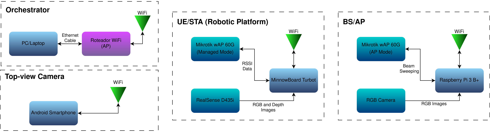

# Samurai mmWaves testbed

This code is based at




## Dependencies

Needed at all the devices:

```
sudo apt-get install make

sudo apt-get install libopencv-dev
sudo apt-get install nlohmann-json3-dev
```

Tested with gcc 11.

### Orquestrator
Acts as a TCP server, receives data from N clients.


1. Build
```
make orq
```

### Clients

#### AP
Raspberry Pi, devices connected: 
- Camera
- Mikrotik wAP 60G Radio

1. Build
```
make ap
```

#### STA
Minnowboard, devices connected:
- Realsense Camera (D435i or L515)
- Mikrotik wAP 60G Radio

1. Install extra depencencies
- Find the exact needed build, v2.54.2 is the latest compatible with L515 (https://github.com/IntelRealSense/librealsense/releases/tag/v2.54.2)
```
apt-cache showpkg librealsense2-dkms
apt-cache showpkg librealsense2-dev
```

- In the "provides" section find the latest build at v2.54.2, something like `2.54.2-0~realsense.10773`, for the two libs above.

- Install

```
sudo apt-get install tmux

sudo apt-get install librealsense2-dkms

# You might need to change these versions
sudo apt-get install librealsense2-utils=2.54.2-0~realsense.10773
sudo apt-get install librealsense2-dev=2.54.2-0~realsense.10773
```


2. Build
```
make sta
```

#### Ceil cam
Raspberry Pi, devices connected:
- Camera

1. Build
```
make ceil
```

## Usage

1. Turn on the devices, including Mikrotik Radios

2. Enable the server at the Orquestrator.
```
mkdir out && cd out
../builds/orquestrator.exe
```

3. At the STA Minnowboard, enable the Mikrotik Radio server.
```
cd ./builds/STA/
sh ./start_radio.sh

```
When the server starts, detach the tmux window with `CTRL + B` then `D`.


4. Enable the desired clients, wait until "Device is ready" message. "Client connected" will appear at the Orquestrator.
```
./builds/sta.exe

./builds/ap.exe

./builds/ceil.exe
```

5. When all the clients are connected, type a number N of measurements at the Orquestrator terminal. The clients will respond with N captures.

### IPs

- Orquestrator: 10.0.0.20
- Minnowboard STA: 10.0.0.31
- Raspberry Ceil Cam: 10.0.0.32
- Rasbperry AP: 10.0.0.39 

### Message types
- 0x01 = rss sta
- 0x02 = rgb sta
- 0x03 = depth sta
- 0x04 = rgb ap
- 0x05 = depth ap
- 0x06 = rgb ceil

### Results

At the Orquestrator:
- A .csv file with the name of the MAC address of the AP Mikrotik Radio is created, it saves the capture timestamp, the receive timestamp and 64 RSSI data (per beam rssi).

- An images directory is created, if all the clients are enabled it should contain 4 directories: rgb_sta, depth_sta, rgb_ceil, rgb_ap. Each image is named as: `[captured_at]_[received_at].jpg`

## TODO

- [ ] Use Realsense L515
- [ ] https://dev.intelrealsense.com/docs/tuning-depth-cameras-for-best-performance
